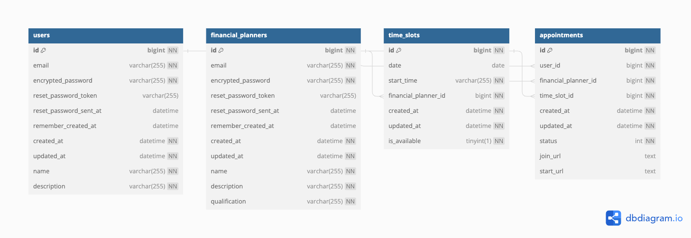

# データベース定義

## DDL
```
CREATE TABLE `Users` (
  `id` integer PRIMARY KEY,
  `name` varchar(255),
  `email` varchar(255),
  `description` varchar(255),
  `password_hash` varchar(255),
  `created_at` timestamp,
  `updated_at` timestamp
);

CREATE TABLE `FinancialPlanners` (
  `id` integer PRIMARY KEY,
  `name` varchar(255),
  `email` varchar(255),
  `description` varchar(255),
  `qualification` varchar(255),
  `password_hash` varchar(255),
  `created_at` timestamp,
  `updated_at` timestamp
);

CREATE TABLE `Appointments` (
  `id` integer PRIMARY KEY,
  `user_id` integer,
  `financial_planner_id` integer,
  `time_slot_id` integer,
  `status` ENUM ('pending', 'confirmed', 'cancelled'),
  `created_at` timestamp,
  `updated_at` timestamp
);

CREATE TABLE `TimeSlots` (
  `id` integer PRIMARY KEY,
  `financial_planner_id` integer,
  `date` varchar(255),
  `start_time` varchar(255),
  `end_time` varchar(255)
);

ALTER TABLE `Appointments` ADD FOREIGN KEY (`user_id`) REFERENCES `Users` (`id`);

ALTER TABLE `Appointments` ADD FOREIGN KEY (`financial_planner_id`) REFERENCES `FinancialPlanners` (`id`);

ALTER TABLE `Appointments` ADD FOREIGN KEY (`time_slot_id`) REFERENCES `TimeSlots` (`id`);

ALTER TABLE `TimeSlots` ADD FOREIGN KEY (`financial_planner_id`) REFERENCES `FinancialPlanners` (`id`);
```

## ER図
